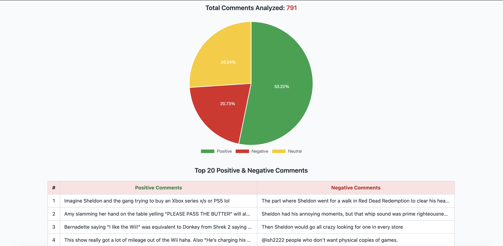

# YouTube Sentiment Analysis 🎥🧠

[](https://www.python.org/)
[](https://opensource.org/licenses/MIT)
[]()

A **Flask-based web app** that analyzes YouTube video comments for **sentiment** and **named entities**. Supports multiple languages by detecting and translating non-English comments to English.

Visualizes results via **charts** and **tables**, giving you insights into positive and negative comments.

---

## **Features ✨**

* Download up to **4000 comments** per video.
* Detect and translate **non-English comments** using **FastText** and **Google Translate**.
* Sentiment analysis with **VADER** and **TextBlob**, combined into a **final sentiment**.
* Extract **top named entities** (people) per sentiment category.
* Real-time **progress updates** streamed to the frontend using **SSE (Server-Sent Events)**.
* Display results:

  * **Pie chart** for sentiment distribution
  * **Top positive/negative comments**
  * **Top positive/negative entities** in a table

---

## **Tech Stack 🛠️**

* **Backend:** Python, Flask
* **Frontend:** HTML, CSS, JavaScript, Chart.js, Tailwind CSS
* **NLP & Sentiment Analysis:** SpaCy, NLTK (VADER), TextBlob, FastText
* **Translation:** Google Translate (`deep-translator`)
* **YouTube Comments:** `youtube-comment-downloader`
* **Data Handling:** Pandas
* **Deployment:** Render

---

## **Demo Screenshot 🖼️**



---

## **Installation 🖥️**

1. Clone the repo:

```bash
git clone https://github.com/yourusername/youtube-sentiment-analysis.git
cd youtube-sentiment-analysis
```

2. Create and activate a virtual environment:

```bash
python3 -m venv venv
source venv/bin/activate  # Windows: venv\Scripts\activate
```

3. Install dependencies:

```bash
pip install -r requirements.txt
```

4. Download required models:

```bash
# SpaCy English model
python -m spacy download en_core_web_sm
```

*The FastText model (`lid.176.ftz`) is automatically downloaded on first run.*

---

## **Usage 🚀**

1. Run the Flask app:

```bash
python app.py
```

2. Open in browser:

```
http://127.0.0.1:5000/
```

3. Paste a **YouTube video link** and click **Analyze**.

4. View:

   * Real-time **progress** of download, translation, and sentiment analysis.
   * **Sentiment pie chart**
   * **Top positive/negative comments**
   * **Top entities table**

---

## **Frontend Validation ✅**

* Checks that the YouTube URL is valid before calling the API.
* Displays error messages for invalid URLs.
* Shows **streaming updates** for download, translation, and analysis progress.

---

## **Project Structure 📁**

```
youtube-sentiment-analysis/
│
├─ app.py                 # Flask backend
├─ templates/
│   └─ index.html         # Frontend page
├─ static/
├─ screenshot.png         # Example screenshot
├─ lid.176.ftz
├─ requirements.txt       # Python dependencies
└─ README.md
```

---

## **License 📝**

This project is open-source under the **MIT License**.
